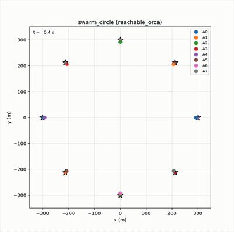

# ORCA for Dubins Vehicle Kinematics

Prototyping sandbox for optimal reciprocal collision avoidance (ORCA) under Dubins vehicle kinematics (constant forward velocity with a minimum turn radius) for local collision avoidance. This was inspired by my path planning work for fixed-wing aircraft, as I wanted to dive more deeply into swarming and local control logic.

## Idea

ORCA decides which local velocities are safe, while Dubins must follow a fixed-wing-feasible maneuver. 
We will constrain ORCA to the aircraft's reachable velocity set (constant speed fixed-wing) over a short horizon:

```math
\mathcal{V}_{\text{Dubins-reachable}}(T_h)
=
\left\{
V
\begin{bmatrix}
\cos(\psi_0 + \Delta\psi) \\
\sin(\psi_0 + \Delta\psi)
\end{bmatrix}
\;:\;
|\Delta\psi|
\le
\frac{g\tan\phi_{\max}}{V}T_h
\right\}.
```

We will first explore another variant that skips continuous optimization; instead, it generates a
small set of control primitives (e.g. max-left, moderate-left, straight,
moderate-right, max-right), propagating each over time horizon, testing against ORCA's
constraints, and pick the feasible one closest to the preferred velocity.

## Results
### 1. 8-body Swarm
[](src/orca_dubins/viz/dubins_swarm_circle.mp4)

Initial test run for proof-of-concept. Click the animation to open the MP4.

## Bringup

Requires Python ≥ 3.11 and [uv](https://docs.astral.sh/uv/):

```bash
uv sync --extra dev          # create venv + install deps
uv run pytest                # smoke tests
uv run python examples/run_demo.py --scenario crossing --show
uv run python examples/run_demo.py --planner primitive_orca --scenario crossing --show
```

The default demo uses the **no-avoidance baseline**, so aircraft fly through
each other. Pass `--planner primitive_orca` to run discrete avoidance.

## Layout

| Theory | File |
|---|---|
| Velocity obstacles | `src/orca_dubins/orca/velocity_obstacle.py` |
| ORCA half-planes / safe set | `src/orca_dubins/orca/orca.py` |
| Dubins reachable set + control primitives | `src/orca_dubins/dubins/primitives.py` |
| Kinodynamic ORCA planner | `src/orca_dubins/planners/reachable_orca.py` |
| Control-primitive planner | `src/orca_dubins/planners/primitive_orca.py` |

## Roadmap

- [x] Velocity obstacles + ORCA half-planes
- [ ] Dubins reachable arc over `T_h`
- [x] Control-primitive generation + rollout
- [ ] `ReachableOrcaPlanner.compute_velocity`
- [x] `PrimitiveOrcaPlanner.compute_velocity`
- [ ] Metrics (min separation, collisions, path efficiency)
- [ ] 3D extension (altitude / climb-rate)
