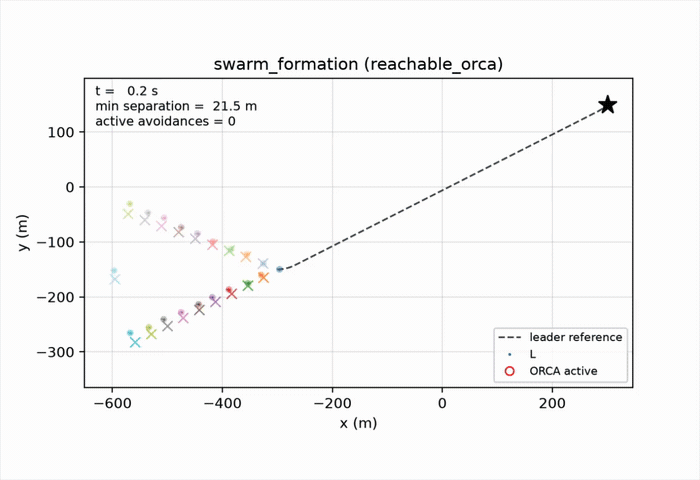

# ORCA for Dubins Vehicle

Optimal reciprocal collision avoidance (ORCA) under Dubins vehicle kinematics for local collision avoidance. This was inspired by my global path planning work for fixed-wing aircraft, as I wanted to explore swarming and local control behaviors.

## Idea

ORCA determines which local velocities are safe, while Dubins enforces a fixed-wing feasible maneuver. We will constrain ORCA to the aircraft's reachable velocity set over a short horizon:

```math
\mathcal{V}_{\text{Dubins-reachable}}(T_h)
=
\left\{
V
\begin{bmatrix}
\cos(\psi_0 + \Delta\psi) \\
\sin(\psi_0 + \Delta\psi)
\end{bmatrix}
\;:\;
|\Delta\psi|
\le
\frac{g\tan\phi_{\max}}{V}T_h
\right\}.
```

We will first explore a variant that generates a small set of control primitives (e.g. max-left, moderate-left, straight, moderate-right, max-right), that propagate over time horizons and satisfy ORCA's constraints. We pick the control primitive closest to the preferred velocity.  

Then, we will move on to continuous optimization. This searchs the entire Dubins-reachable heading arc for the ORCA-feasible velocity closest to the preferred velocity, rather than just a fixed/limited set of primitives.

## Results
### 20-body Swarm


We simulate a 20-body swarm with one leader following a sampled Dubins route and 
19 followers tracking a V-shape formation. We schedule three "exchanges," which mirrors
the followers' assigned V slots across the formation to create crossing conflicts.  

The `X` represent assigned slots. Blinking dots signal active collision avoidance.

## Bringup

Requires Python ≥ 3.11 and [uv](https://docs.astral.sh/uv/):

```bash
uv sync --extra dev   # create venv + install deps

# Demos
uv run python examples/run_demo.py --scenario crossing --show
uv run python examples/run_demo.py --planner primitive_orca --scenario crossing --show
uv run python examples/run_demo.py --planner reachable_orca --scenario swarm_random --seed 7 --show
uv run python examples/run_demo.py --planner reachable_orca --scenario swarm_formation --show
```

The default demo uses the no-avoidance baseline, so aircraft fly through each other.

## Layout

| Theory | File |
|---|---|
| Velocity obstacles | `src/orca_dubins/orca/velocity_obstacle.py` |
| ORCA half-planes / safe set | `src/orca_dubins/orca/orca.py` |
| Dubins reachable set + control primitives | `src/orca_dubins/dubins/primitives.py` |
| Classical Dubins paths + sampling | `src/orca_dubins/dubins/path.py` |
| Kinodynamic ORCA planner | `src/orca_dubins/planners/reachable_orca.py` |
| Control-primitive planner | `src/orca_dubins/planners/primitive_orca.py` |
| Mission guidance | `src/orca_dubins/simulation/guidance.py` |

## Roadmap

- [x] Velocity obstacles + ORCA half-planes
- [x] Dubins reachable arc over `T_h`
- [x] Control-primitive generation + rollout
- [x] `ReachableOrcaPlanner.compute_velocity`
- [x] `PrimitiveOrcaPlanner.compute_velocity`
- [x] Leader Dubins-path guidance + follower formation guidance
- [x] Metrics (minimum separation, route error, formation error)
- [ ] 3D extension (altitude / climb-rate)
